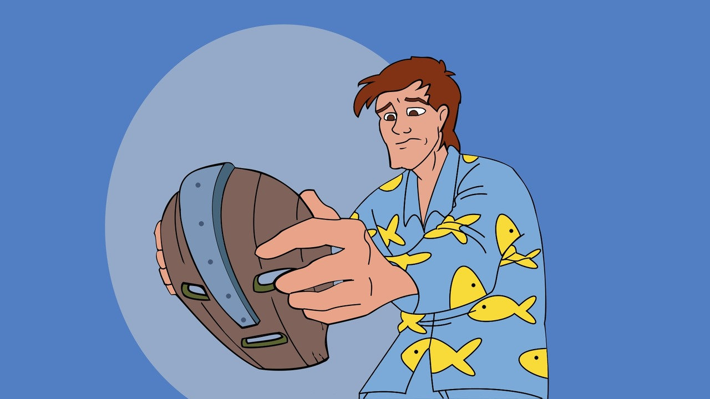

<h1 align="center">
  <br>
  <a href="https://github.com/ODGodinho"></a>
  <br>
  Stanley The Template - <a href="https://github.com/ODGodinho">By ODGodinho</a>
  <br>
</h1>

<h4 align="center">🔥 Template PHP Stanley feito por Dragons Gamers! 🔥</h4>

<p align="center">

  <a href="https://www.linkedin.com/in/victor-alves-godinho-479647142/">
    
  </a>

  
   <a href="https://github.com/ODGodinho/stargazers">
    
  </a>
</p>


---

## 🖥 Tecnologias/Pacotes

#### `Back-end`

- [PHP-CS](https://github.com/squizlabs/PHP_CodeSniffer#about)
- [PHPUnit](https://github.com/sebastianbergmann/phpunit#phpunit)
- [Lumen](https://lumen.laravel.com/)
- [Laravel](https://laravel.com/docs/master)
- [Debug-Bar](https://github.com/barryvdh/laravel-debugbar#laravel-debugbar)
- [Tinker](https://github.com/laravel/tinker#introduction)
- [PHP-Compatibility](https://github.com/PHPCompatibility/PHPCompatibility#php-compatibility-coding-standard-for-php-codesniffer)

<br>

## 📁 Dependências

#### para executar a aplicação sera necessário o [PHP 8](https://www.php.net/releases/8.0/pt_BR.php) e o Docker
<br>

- PHP 8 ou Maior
```bash
$ sudo apt-get install php8.0 php8.0-xml php8.0-mbstring
```
- Composer 2.0 Global
- Docker version 20.10
- Docker Composer 1.29.2

<br>

## 🎴 Como Usar?

```bash
# bash start.bash
```

Siga os Passos no comando e seja feliz.

<br>

## 🍥 Layout

- N/A

<br>


## 📙 Licença

> Com base nos termos de [PRIVATE](https://opensource.org/licenses)

<br>

##### Feito por DragonsGamers com 💕💘
